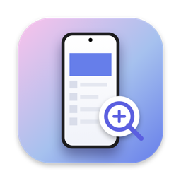
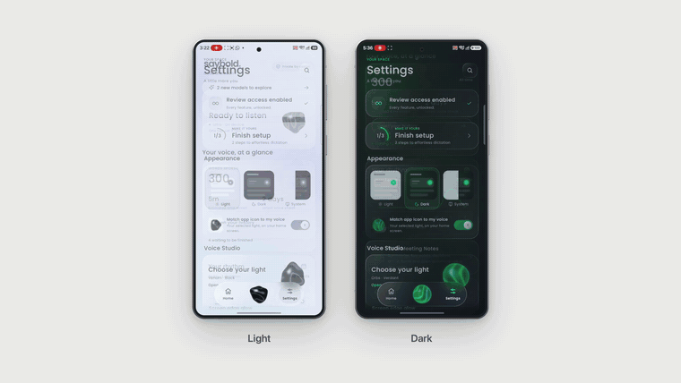
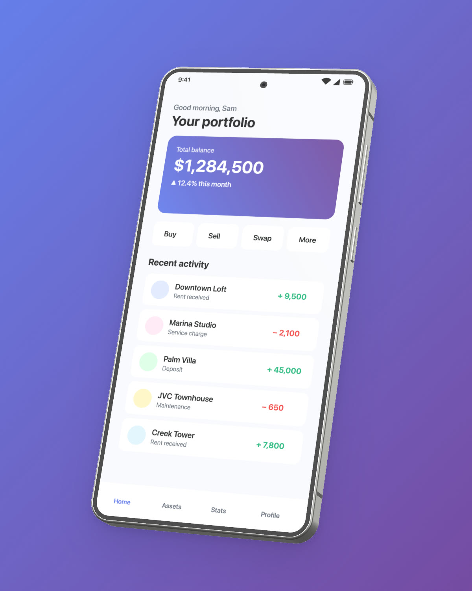
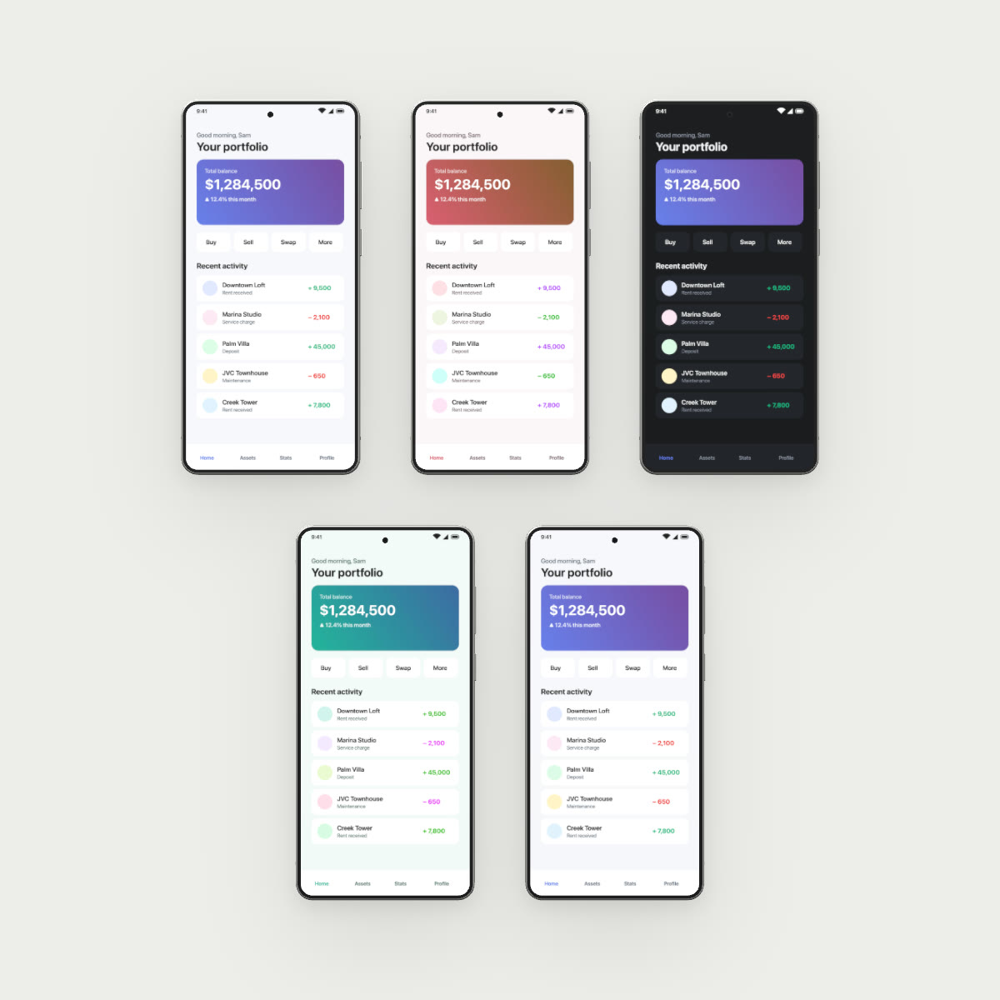
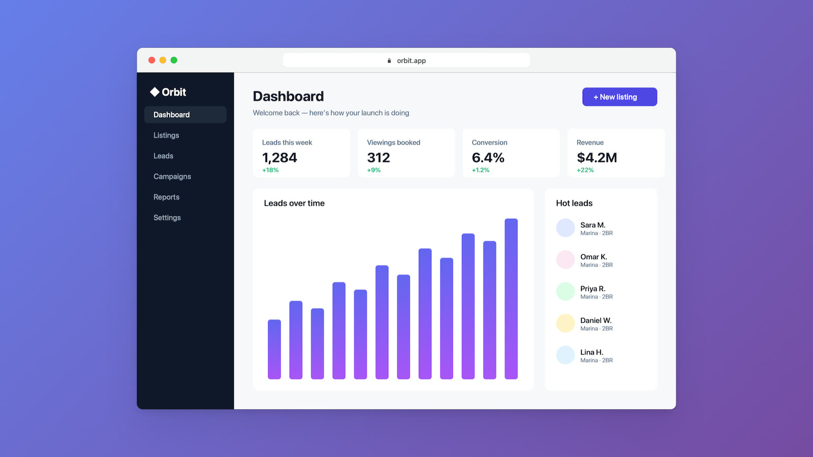
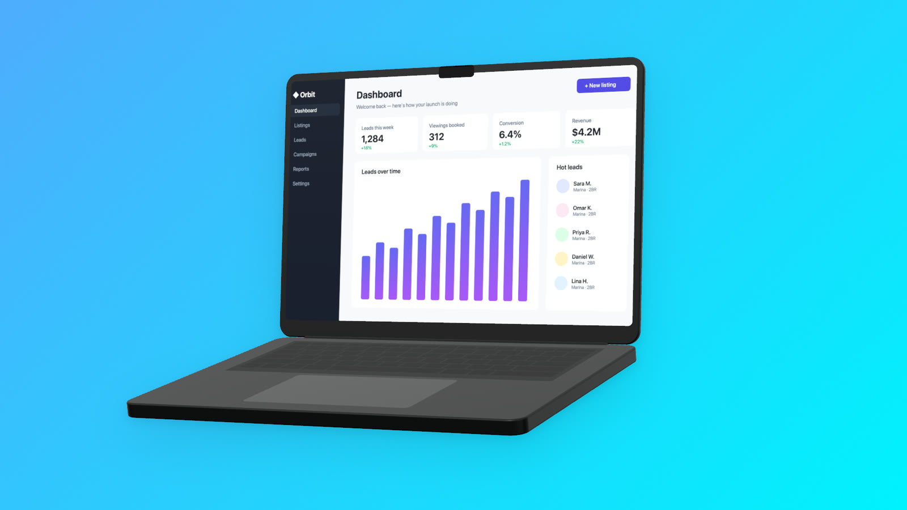
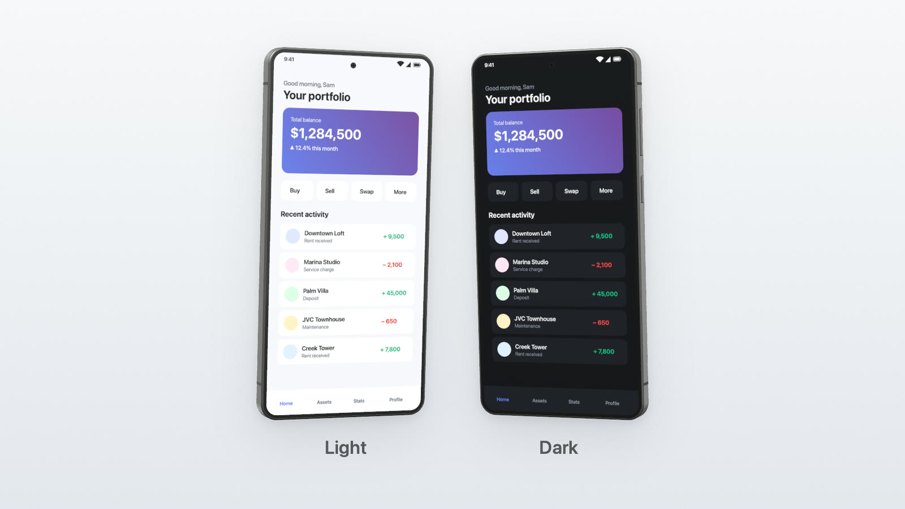
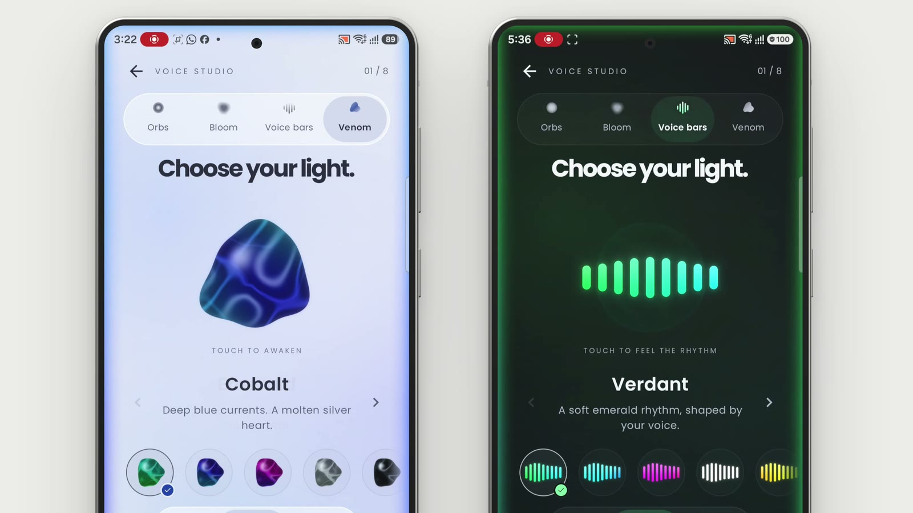
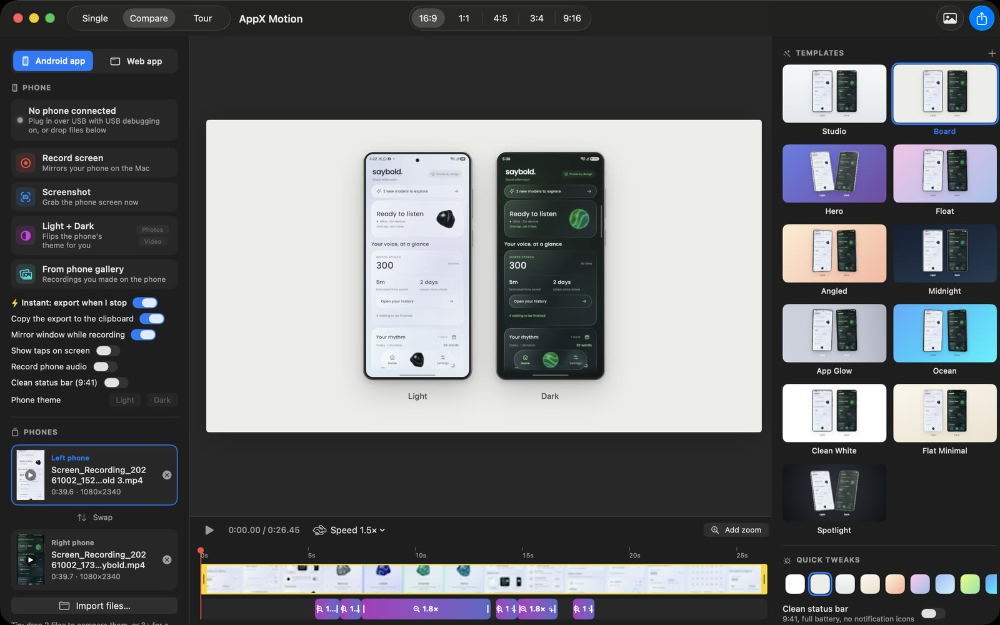

<div align="center">



# AppX Motion

**Turn raw app recordings into scroll-stopping showcase videos.**
Realistic 3D devices, automatic zooms, light-vs-dark comparisons and camera tours.
Exported in 4K with colours that stay true on X.

[](#install)
[](#install)
[](#build-from-source)
[](LICENSE)
[](https://github.com/tabish075/AppXMotion/releases/latest)

[**⬇︎ Download for Mac**](https://github.com/tabish075/AppXMotion/releases/latest/download/AppX-Motion-1.0.0-macOS.dmg) · [Watch the 4K demo](https://github.com/tabish075/AppXMotion/releases/download/v1.0.0/appx-motion-demo-4k.mp4) · [Features](#features) · [Install](#install)

<br>

**Featured in this demo: [Saybold](https://saybold.io)**. Check it out at [saybold.io](https://saybold.io).

<a href="docs/media/demo-1080p.mp4"></a>

<sub>Made with AppX Motion in one click: two raw Samsung screen recordings → <i>Board</i> template, auto-zoom, 1.5× speed, 4K export.
<a href="docs/media/demo-1080p.mp4">1080p</a> · <a href="https://github.com/tabish075/AppXMotion/releases/download/v1.0.0/appx-motion-demo-4k.mp4">4K</a></sub>

</div>

---

Posting raw phone screenshots gets scrolled past. Polished product videos get engagement, but they usually take
an editor, mockup files and an afternoon. **AppX Motion does it in one step:** record your Android app (or any web app on
your Mac), pick a template, and get an X-ready 4K video with a realistic device, a soft shadow, a beautiful
background and zooms that land exactly where you tapped.

## Features

| | |
|---|---|
| 📱 **Realistic 3D devices** | A Galaxy S26 Ultra-style phone with a titanium frame, glass reflections and side keys, and a 3D MacBook. Four angles: *Front, Angled, Hero, Float*. Six titanium finishes. Adjustable corners. |
| ✨ **One-click templates** | Every template is previewed live with *your own* screens. Pick one once; it's remembered. Save your own with **+**. |
| 🔍 **Automatic zoom** | AppX Motion analyses the recording and zooms into taps, toggles and typing, then pans between them and zooms out when you scroll. No keyframes. |
| ⚡ **Speed & sped-up pauses** | 0.5× to 3×, and loading or waiting moments play 4× faster automatically. Zooms stay locked to the right moments. |
| 🌗 **Light vs Dark** | One click flips your phone's theme, captures both and builds the side-by-side, labels included. Or record two guided video takes. |
| 🎬 **Camera tours** | Drop 3+ screens: an overview board, then the camera flies into each screen with close-ups and pulls back out. |
| 🖥 **Web apps too** | Record any Mac window (Chrome, Safari…). Your clicks drive the auto-zoom, with optional click ripples. Show it in a clean *Browser* frame with your URL, a rounded *Window*, or a 3D *MacBook*. |
| 🧹 **Clean status bar** | Replaces the phone's status bar with 9:41, full battery and no notifications. Works with any phone (including Samsung) and old recordings. |
| 🎯 **Made for X** | 4K/60 export (1080p and 1440p too), H.264 with BT.709 colour tags so colours don't shift after X re-encodes, under X's file-size limit. |
| ⚡ **Instant mode** | Press **Stop** on a recording → it's auto-zoomed, exported and on your clipboard. Paste straight into X. |
| 💾 **Projects** | Everything autosaves and reopens where you left off. Save and share `.appxmotion` project files. |

## Gallery

<table>
<tr>
<td width="50%"><br><sub><b>Hero</b>: 3D phone, titanium white</sub></td>
<td width="50%"><br><sub><b>Tour</b>: overview board before the camera flies in</sub></td>
</tr>
<tr>
<td><br><sub><b>Web</b>: clean browser frame with your URL</sub></td>
<td><br><sub><b>Web</b>: 3D MacBook, angled</sub></td>
</tr>
<tr>
<td><br><sub><b>Compare</b>: Light vs Dark, angled</sub></td>
<td><br><sub><b>Auto-zoom</b>: frame from the demo above</sub></td>
</tr>
</table>



## Install

1. **Download** [`AppX-Motion-1.0.0-macOS.dmg`](https://github.com/tabish075/AppXMotion/releases/latest/download/AppX-Motion-1.0.0-macOS.dmg) (universal: Apple Silicon and Intel, macOS 15 Sequoia or newer).
2. Open it and drag **AppX Motion** into **Applications**.
3. **First launch:** AppX Motion isn't notarised by Apple yet, so macOS will warn you the first time. Open it once, then go to
   **System Settings › Privacy & Security** and click **Open Anyway**. Or run:
   ```bash
   xattr -dr com.apple.quarantine "/Applications/AppX Motion.app"
   ```

### For Android capture (optional)
AppX Motion talks to your phone with [scrcpy](https://github.com/Genymobile/scrcpy) and `adb`:
```bash
brew install scrcpy android-platform-tools
```
On the phone: **Settings › About phone › tap Build number 7×**, then **Developer options › USB debugging** on.
Plug in over USB and tap **Allow** on the phone. AppX Motion shows it as connected.

You can also just **drag recordings in**: anything you recorded on the phone, or use **From phone gallery** to pull them over USB.

### For web capture
Switch to **Web app** at the top of the sidebar. The first time you record, macOS asks for **Screen Recording** permission
(System Settings › Privacy & Security › Screen & System Audio Recording).

## Quick start

1. **Pick a template** on the right (once; it's remembered).
2. **Record** (⌘R): use your app on the phone or in the mirror window, then press **Stop** in the floating pill.
3. With **Instant** on, the 4K video is ready and on your clipboard. **Paste into X.** Done.

Want to tweak? Everything is optional: background, finish, angle, corners, speed, auto-zoom strength and headline sit in
*Quick tweaks*. *More options* has the rest.

### Layouts
- **Single**: one device with automatic zooms.
- **Compare**: two devices side by side (Light / Dark labels). Drop 2 files, or use **Light + Dark**.
- **Tour**: drop 3+ screenshots or recordings for a camera tour of all of them.

### Keyboard
| Key | Action | Key | Action |
|---|---|---|---|
| ⌘R | Record / stop | Space | Play / pause |
| ⇧⌘S | Screenshot | ← / → | Step a frame (⇧ for 1 s) |
| ⇧⌘L | Light + Dark screenshots | Z | Add a zoom at the playhead |
| ⌘E | Export for X | ⌫ | Delete the selected zoom |
| ⇧⌘E | Save current frame as 2× PNG | I / O | Trim in / out |
| ⌘S / ⇧⌘O | Save / open project | ⌥⌘1 / ⌥⌘2 | Android / Web workspace |

## Tips for crisp posts on X
- Export at **4K** (default). X Premium accepts 4K uploads on web and iPhone; everyone else gets a sharp 1080p version.
- **4:5** gives the biggest phone in the timeline for a single device; **16:9** suits comparisons and tours.
- Lower the **Corners** slider if your app has content right in the screen corners.
- Keep **Speed up pauses** on: shorter demos get watched to the end.

## How it works
- **Rendering**: Core Image for 2D frames and backgrounds, SceneKit (Metal) for the 3D devices. One custom AVFoundation compositor powers both the live preview and the export, so what you see is what you get.
- **Auto-zoom**: frames are compared at low resolution. Small, local changes (taps, toggles, typing) become zooms pinned to that spot on the screen; full-screen changes (scrolling, page transitions) end them. Web recordings use your exact click positions.
- **Colour**: everything is rendered in sRGB and encoded as H.264 with BT.709 primaries, transfer and matrix, which is what browsers and X expect. Flat colour patches round-trip bit-exactly.
- **Capture**: `scrcpy` for Android (with a mirror window), ScreenCaptureKit for Mac windows.

## Command line
The app doubles as a headless renderer:
```bash
APPX="/Applications/AppX Motion.app/Contents/MacOS/AppXMotion"
"$APPX" render --a rec.mp4 --out post.mp4 --pose float --finish ti-silverblue --bg grape --speed 1.5 --pauses fast
"$APPX" render --a light.png --b dark.png --out compare.png --canvas landscape --pose angled
"$APPX" render --tour s1.png,s2.png,rec.mp4 --out tour.mp4 --canvas square --bg board
"$APPX" render --a page.png --out web.png --frame browser --url myapp.com
"$APPX" device-test     # checks adb, screenshots, theme switching and scrcpy recording
```
Options include `--canvas landscape|square|portrait|tall|story`, `--frame galaxy3D|phone|minimal|screenOnly|browser|window|macbook3D`,
`--pose front|angled|hero|float`, `--autozoom off|subtle|normal|punchy`, `--zoom start:end:scale:x:y`, `--title`, `--labels "Light,Dark"`,
`--fps`, `--time` (a PNG of one moment) and `--scale 1|2`.

## Build from source
Requires macOS 15+ and the Xcode Command Line Tools (Swift 6). Full Xcode isn't needed.
```bash
git clone https://github.com/tabish075/AppXMotion.git && cd AppXMotion
scripts/build-app.sh --install        # builds "AppX Motion.app" and copies it to /Applications
scripts/package-release.sh 1.0.0      # universal app + DMG in dist/
```

<details>
<summary><b>Project layout</b></summary>

| Path | What |
|---|---|
| `Render/Phone3D.swift`, `Render/Laptop3D.swift` | SceneKit 3D devices, finishes, poses and the Metal render path |
| `Render/SceneRenderer.swift` | Per-frame composition and the zoom camera |
| `Render/SceneLayout.swift`, `Render/ScenePainter.swift` | Device and text layout; backgrounds, flat frames, browser chrome and shadows |
| `Render/Compositor.swift` | Custom AVFoundation compositor shared by preview and export |
| `Render/Tour.swift` | Tour timing and camera path |
| `Render/StatusBarCleaner.swift` | Clean 9:41 status bar |
| `Analysis/AutoZoom.swift` | Motion analysis → automatic zooms and sped-up pauses |
| `Model/TimeMap.swift` | Speed changes (clip time ↔ output time) |
| `Export/ExportEngine.swift` | MP4/PNG export tuned for X |
| `Device/` | adb + scrcpy (Android), ScreenCaptureKit (Mac windows) |
| `App/`, `UI/` | App state and SwiftUI interface |
</details>

## FAQ

**Is there a Windows version?**
Not yet. AppX Motion is built on Apple frameworks (SwiftUI, AVFoundation, SceneKit and ScreenCaptureKit), so Windows would need a port.
If you'd like one, please [open an issue](https://github.com/tabish075/AppXMotion/issues) or 👍 an existing one.

**Does it work with iPhone recordings?**
Yes. Drop any screen recording or screenshot in; device frames adapt to its shape.

**Why does macOS warn me when I open it?**
The app isn't signed with a paid Apple Developer ID yet. See [Install](#install) step 3. The full source is right here if you'd rather build it yourself.

**Where are my files?**
Captures, exports and projects are in `~/Movies/AppX Motion`.

## Acknowledgements
Built on [scrcpy](https://github.com/Genymobile/scrcpy) for Android mirroring and recording.
The 3D devices are modelled from published dimensions and contain no manufacturer artwork. *Galaxy* is a trademark of
Samsung and *MacBook* of Apple; AppX Motion isn't affiliated with either.

## License
[MIT](LICENSE)
